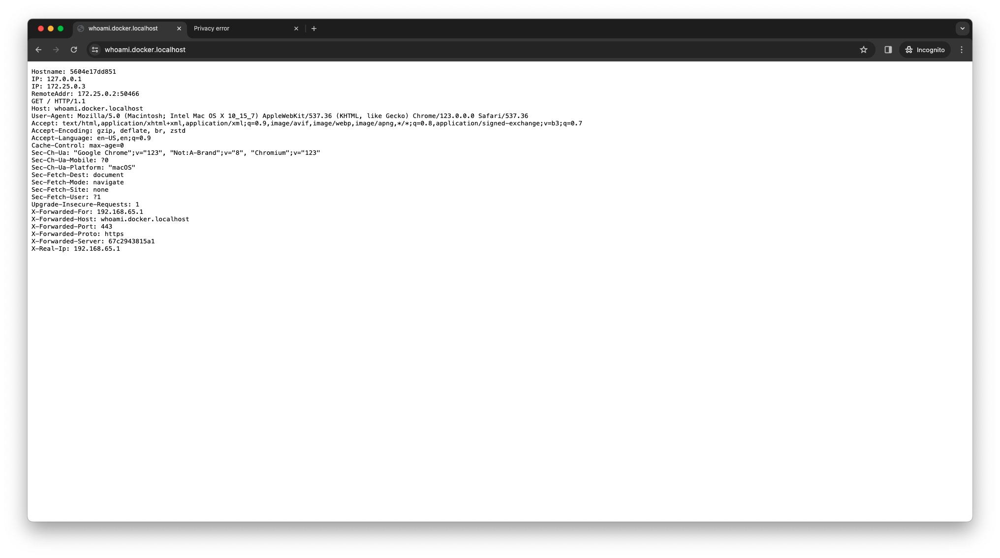

# Traefik v3 HTTPS (SSL) on localhost

This repo is a minimal template to use Traefik v3 on localhost with HTTPS support.

To get started, just clone this repo:

```
git clone https://github.com/thienhaole92/traefik-v3-https-ssl-localhost.git
```

Next, go to the root of the repo (`cd traefik-v3-https-ssl-localhost`) and generate certificates using [mkcert](https://github.com/FiloSottile/mkcert) :

If it's the firt install of mkcert, run

```bash
mkcert -install
```

Generate certificate for domain `docker.localhost`, `domain.local` and their sub-domains

```bash
mkcert -cert-file certs/local-cert.pem -key-file certs/local-key.pem "docker.localhost" "*.docker.localhost" "domain.local" "*.domain.local"
```

This command results in the creation of two files: `local-cert.pem` (containing the certificate) and `local-key.pem` (containing the private key) located under `certs` folder.

Now, start containers with :

```bash
docker-compose -f docker-compose.yml up
```

Now that we are serving up our endpoint with SSL, let's see what happens in our browser. We will use Chrome, go to your browser at [whoami.docker.localhost](https://whoami.docker.localhost)

If you encounter the following error in your browser: `Your connection is not private`, it's likely that the certificate is not trusted by your system. We'll deal with this


Export certificate from your browser


Add it to macOS Monterey Keychain

If you're using macOS, you can add the root certificate to your system's trusted certificates by double-clicking the \*.cer exported file


Trust the certificate by double-click on your certificate in the list then expand the Trust section, change the "When using this certificate:" select box to Always Trust


Now, with our CA trusted, let's use Chrome to visit our endpoint again [whoami.docker.localhost](https://whoami.docker.localhost)



Excellent :rocket: !

_Note: you can access to Træfik dashboard at: [traefik.docker.localhost](https://traefik.docker.localhost)_

Don't forget that you can also map TCP and UDP through Træfik.

# License

MIT
